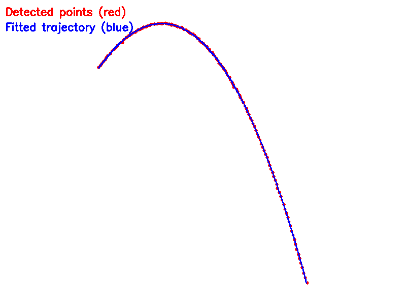

# 弹丸轨迹分析系统

本项目使用OpenCV和Ceres Solver库来分析弹丸的飞行轨迹，通过视频数据拟合弹丸的初始速度、重力加速度和空气阻力系数。

## 功能特点

- 从视频序列中提取蓝色弹丸的飞行轨迹
- 使用Ceres Solver进行非线性最小二乘拟合
- 计算弹丸的初始速度(vx0, vy0)、重力加速度(g)和空气阻力系数(k)
- 可视化轨迹点和拟合曲线的对比图

## 技术实现

### 数学模型

项目使用指数衰减模型来描述弹丸在空气阻力影响下的运动：

$$x(t) = x₀ + \frac{v_{x_{0}}}{k}(1 - e^{-kt})$$
$$y(t) = y₀ + \frac{(v_{y_{0}} + g/k)}{k}(1 - e^{-kt}) - \frac{g}{k}t$$

其中：
- x₀, y₀: 初始位置
- vₓ₀, vᵧ₀: 初始速度分量
- g: 重力加速度
- k: 空气阻力系数

## 文件结构

```
.
├── CMakeLists.txt          # CMake构建配置
├── fit.cpp                 # 主程序文件
├── frames/                 # 视频帧图像序列
├── build/                  # 构建目录
├── trajectory_comparison.png # 轨迹对比图
```

## 拟合结果


```
Reading image sequence...
Loaded 144 frames
FPS: 60, Total frames: 144
Detected 144 trajectory points
Improved initial estimates: g = -300, k = 0.05
Estimated initial velocities: vx0 = 253.587, vy0 = -293.315
Estimated initial g = -300, k = 0.05
iter      cost      cost_change  |gradient|   |step|    tr_ratio  tr_radius  ls_iter  iter_time  total_time
   0  1.610347e+02    0.00e+00    9.50e-01   0.00e+00   0.00e+00  1.00e+04        0    3.44e-03    3.70e-03
   1  8.200854e+01    7.90e+01    3.79e+00   0.00e+00   4.83e+00  3.00e+04        1    6.07e-03    9.84e-03
   2  4.899908e+01    3.30e+01    7.95e+00   1.65e+01   3.34e+00  9.00e+04        1    5.62e-03    1.55e-02
   3  3.074841e+01    1.83e+01    8.93e+00   5.11e+00   2.74e+00  2.70e+05        1    5.25e-03    2.07e-02
   4  2.894300e+01    1.81e+00    4.55e+00   3.36e-01   1.56e+00  8.10e+05        1    5.10e-03    2.58e-02
   5  2.855699e+01    3.86e-01    2.10e+00   1.37e-01   1.50e+00  2.43e+06        1    4.95e-03    3.08e-02
   6  2.845813e+01    9.89e-02    9.94e-01   1.03e-01   1.53e+00  7.29e+06        1    5.13e-03    3.59e-02
   7  2.842802e+01    3.01e-02    9.32e-01   7.31e-02   1.58e+00  2.19e+07        1    5.12e-03    4.10e-02
   8  2.841740e+01    1.06e-02    9.32e-01   5.17e-02   1.61e+00  6.56e+07        1    5.02e-03    4.61e-02
   9  2.841320e+01    4.19e-03    9.32e-01   3.68e-02   1.64e+00  1.97e+08        1    4.92e-03    5.10e-02
  10  2.841141e+01    1.79e-03    9.32e-01   2.62e-02   1.66e+00  5.90e+08        1    5.00e-03    5.60e-02
  11  2.841061e+01    8.05e-04    9.32e-01   1.86e-02   1.68e+00  1.77e+09        1    4.92e-03    6.09e-02
  12  2.841023e+01    3.74e-04    9.32e-01   1.31e-02   1.69e+00  5.31e+09        1    5.09e-03    6.60e-02
  13  2.841006e+01    1.77e-04    9.32e-01   9.16e-03   1.69e+00  1.59e+10        1    5.22e-03    7.12e-02
  14  2.840997e+01    8.50e-05    9.32e-01   6.39e-03   1.69e+00  4.78e+10        1    4.90e-03    7.62e-02
  15  2.840993e+01    4.11e-05    9.32e-01   4.44e-03   1.70e+00  1.43e+11        1    5.30e-03    8.15e-02
Ceres Solver Report: Iterations: 16, Initial cost: 1.610347e+02, Final cost: 2.840993e+01, Termination: CONVERGENCE
Fitted parameters:
x0: 163.396
y0: 128.502
vx0: 253.604 px/s
vy0: -349.957 px/s
g: -500.055 px/s^2
k: 0.0682609 1/s

```
